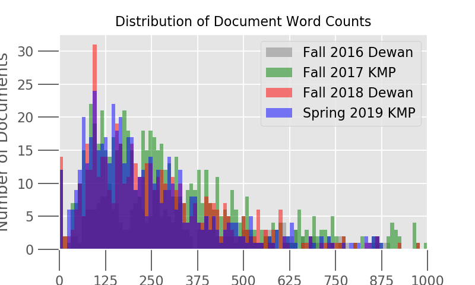
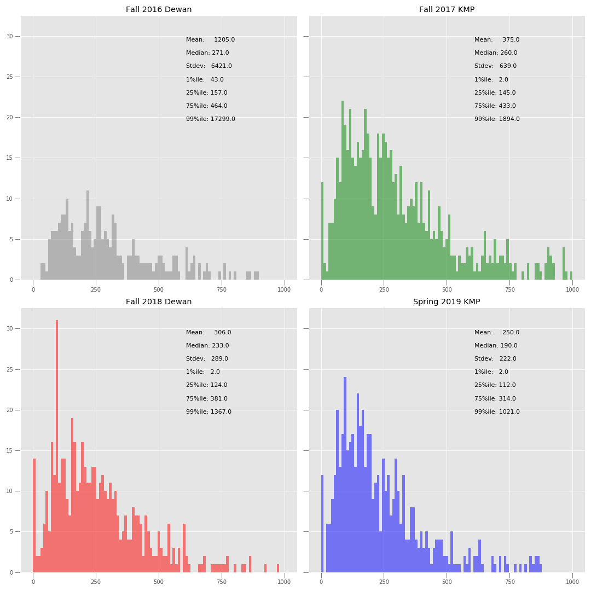

# PiazzaTextualAnalysis


#### <center><u>Project Description and Motivation</u></center>

In this project, we investigated students’ concepts and mental models through the examination of their work on assignments in COMP401 through Piazza data. We analyzed their working and learning process through their interactions with other students and instructors on Piazza, as compared to how they interact with other students and instructors in office hours face-to-face. 

This research direction was motivated by observing the usage of Piazza when we were students in COMP401 and then as LAs in 401 and other classes, and wondering if there was anything we would learn from students and their primary concerns that might not be thoroughly voiced during in person interactions in office hours or to instructors. We also wanted to understand if Piazza is being used to its maximum efficacy and capacity, because as a distributed collaboration tool meant for educational use, it’s rather powerful and has a lot of features, many often not fully used to lessen the flow and burden of office hours and LA effort.

#### <center><u>Data and Modeling</u></center>
Data for the project was collected through the [Piazza API](#https://github.com/hfaran/piazza-api) and managed using a variety of Python Data Science and Scientific Computing tools (`numpy`, `pandas`). For creating data visualizations, `wordcloud` and `matplotlib` were used.

For the modeling portion we used `sklearn` for running our Latent Dirichlet Allocation (LDA) Model and a tf-idf (term frequency-inverse document frequency)/vector space model combo for the similarity analysis portion.

#### <center><u>Guiding Questions and Project Findings</u></center>

Our guiding questions throughout the project included: 
    - Are students using Piazza to ask more conceptual or applied questions? Which topics are more prevalent on Piazza?
    - Where is the most confusion?
    - How do the answers to these compare to observing office hours?
    - What are the things that in-person interactions don’t already tell us that Piazza does?
    - What areas of student understanding require greater attention? 
    - What are students potentially more afraid to ask about?

***

#### <center><u>Code</u></center>

##### Setup
```
pip install -r requirements.txt
echo 'export PIAZZA_EMAIL=<YOUR_PIAZZA_EMAIL_HERE>' >> ~/.bash_profile
echo 'export PIAZZA_PASSWORD=<YOUR_PIAZZA_PASSWORD_HERE>' >> ~/.bash_profile
```

[Source Code](https://github.com/akan72/PiazzaTextualAnalysis/tree/master/piazzatextualanalysis)

***
#### <center> Data Visualizations</center>

<br></br>
 
<br></br>
 
<br></br>
 
<br></br>
 
<br></br>

***
#### <center>License</center>
This project is licensed under the MIT License.